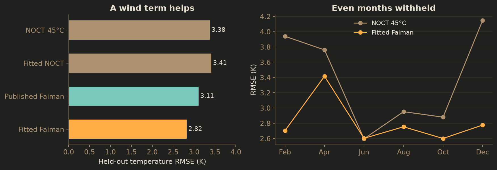
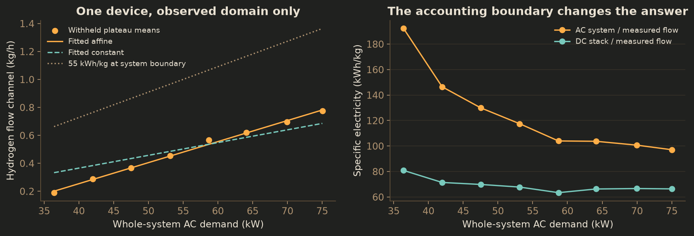
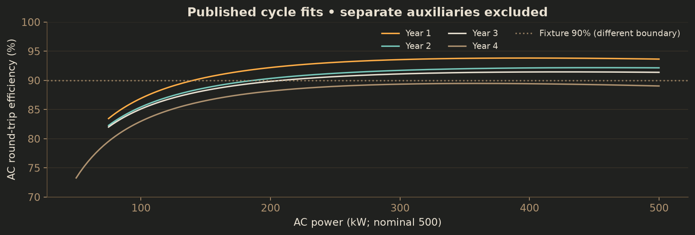
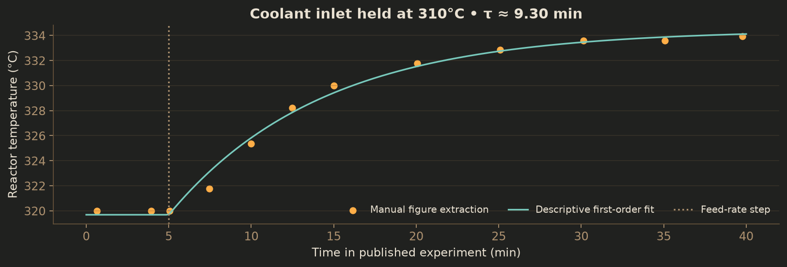
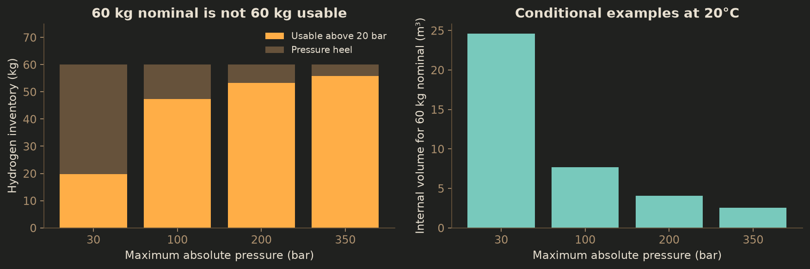

# A firmer physical basis

## What this deeper pass changes

**We can calibrate substantially more than the first review established.** This pass moves beyond broad technology targets: it fits original European solar measurements and a commercial PEM electrolyser dataset, reconstructs a published reactor response, reproduces a near-scale battery efficiency curve, and checks a hydrogen-density equation against independent published test points. It also gives the field-hardware families much more specific resource and capability boundaries.

The important qualification is *which model has been calibrated*. We now have several usable, named reference cases. We do not yet have a calibrated 1 MW solar-to-methane installation in London, Seville or Copenhagen. Transferring a coefficient between systems requires matching the equipment, electrical boundary, operating range and measurement conditions. That is a tractable engineering task; it should no longer be an undifferentiated “uncalibrated” label.

| Area | What was actually done here | Consequence for Dispatch Lab |
|---|---|---|
| Solar temperature | Fit 12,858 observations; test on 13,165 different observations | A wind-aware reference model improves held-out temperature error from **3.38 to 2.82 K**. A fitted single NOCT constant does not improve it. |
| PEM electricity and hydrogen | Fit and test separate halves of eight long load plateaus from 15,068 one-second samples | Whole-system AC demand and the original hydrogen-flow channel need a different relationship from stack DC demand and control-system flow. |
| Battery | Reproduce published curves from a **500 kW / 822 kWh** field installation | Efficiency depends on load and the treatment of auxiliary electricity; 90% is not a complete loss model. |
| Reactor | Digitize a measured load-step temperature response and fit a reduced model | An effective **9.3-minute** coolant-controlled response is identifiable. Independent thermal capacity and outdoor heat loss are not. |
| Gas and chemistry | Verify five NIST density points; calculate pressure heels and temperature-dependent enthalpy | “60 kg storage” needs a pressure/usable-inventory definition. Feed heating is large enough to affect dispatch. |
| Service system | Read named product specifications, operating manuals and long-running inspection results | Resource consumption, operating eligibility, observation failures and repair capability must remain separate. |

The first four results are supported respectively by the SUPSI experimental archive, the Veatch data and source code, Grimaldi’s field study, and Sauerschell’s pilot experiment. The numerical results below are our own calculations from those sources. [[pv-data]] [[pem-data]] [[pem-code]] [[battery]] [[slurry]]

**My recommendation:** introduce versioned reference equipment profiles and repair the few model boundaries that prevent their use. Start with electrical support loads, pressure-dependent usable hydrogen, reactor heat paths and measurement uncertainty. These changes can alter the value of every control and repair decision. Keep learned-policy development paused until the comparison environment represents them coherently.

This research does not change production defaults, enable new repair capabilities, rewrite archives, modify the illustrations, or resume the paused experiment programme. It produces the evidence and reproducible reference calculations needed to make those changes reviewable.

## How the evidence was handled

The starting point was the existing registry of **407 parameter paths and 19 mechanism groups**, together with the field-realism review and its 14 hardware families. I sought original measurements and author repositories, followed papers to their full experimental methods, inspected figures and parameter tables, and checked manufacturers’ actual operating requirements. Search coverage included reactor step tests and catalyst ageing; PEM system efficiency, startup and dynamic degradation; stationary battery conversion and auxiliaries; gas metrology; European soiling; robotic deployment reliability; support utilities and European installed costs.

The analysis separates five kinds of result. **A new reference fit** estimates parameters from downloaded observations with an explicit withheld subset. **A digitized fit** reconstructs a plotted response with extraction error, not original raw data. **A reproduced published fit** implements the authors’ coefficients without claiming independent validation. **A physical reference calculation** checks a documented equation or conservation relationship. **A vendor specification** defines a named device’s claimed capability under its stated conditions. None becomes a universal plant constant just because its source is credible.

The solar and electrolyser split rules were recorded before coefficient fitting. A separately saved clarification excludes short commissioning plateaus in the PEM file and makes clear that January is part of the main solar training split. Missing measurements remain missing; there is no filtering by whether a model happens to predict them well. Unsuccessful downloads are retained in the retrieval log, including the blocked direct PEM archive and the battery PDF download. The battery paper was readable through the research browser; the PEM files came from the dataset’s linked author repository.

This is a targeted evidence review, not a registered systematic review of every publication. It does not infer that unpublished vendor data does not exist. Where an abstract, rather than a full paper, was accessible, the source record says so and the claim stays within that abstract. Reference profiles, source records, split definitions, fitted outputs, input hashes and checks are supplied alongside this report. All calculated results can be regenerated offline from the cached numerical inputs.

## Solar: a real fit, and a useful failed simplification

SUPSI’s Task 13 archive provides a characterized crystalline-silicon module and a year of outdoor observations from Switzerland. The records include plane-of-array irradiance, module back temperature, ambient temperature, wind and measured maximum power. Laboratory characterization supplies the module’s reference power and temperature coefficient. This is much stronger than treating a default NOCT value as if it were an observation. The module is not a specified commercial model for our three European sites. [[pv-data]] [[pv-report]]

I retained 26,023 of 36,449 records after requiring finite thermal inputs, irradiance of at least 200 W/m², and nonnegative wind. Odd calendar months form the training set; even months are withheld. Both are from the same module and site. This tests seasonal coverage and internal transfer, not a second installation.

Our current temperature rule has one effective heat-rise coefficient. The Faiman form adds wind:

`Tmodule = Tambient + Gpoa / (U0 + U1 × wind)`

The fitted coefficients are **U0 = 27.28 W/(m² K)** and **U1 = 4.47 W·s/(m³ K)**. The published characterization’s values are 29.84 and 3.44. Their difference is unsurprising: outdoor fitting, characterization conditions and thermal transients need not identify identical effective parameters.

| Temperature model | Held-out RMSE | Interpretation |
|---|---:|---|
| Existing NOCT 45°C | 3.38 K | Simple baseline |
| Fitted NOCT 44.76°C | 3.41 K | Fitting the same structure makes hold-out performance slightly worse |
| Published Faiman coefficients | 3.11 K | Independent laboratory/reference parameters |
| Fitted Faiman coefficients | 2.82 K | Best internal hold-out result in this comparison |

An 80-replicate whole-day bootstrap gives conditional 95% percentile intervals of **26.96–27.81** for U0 and **3.78–4.97** for U1. These describe resampling variability within this dataset. They exclude sensor bias, different mounting, wind-height conversion, shading and transfer to another site. A separate July-only fit tested on January gives 3.75 K RMSE and a +1.69 K bias: a summer fit should not be mistaken for a winter calibration.

There is also a useful limit. Applying the laboratory reference power, measured back temperature and linear power coefficient gives a **19.6 W** power RMSE for a roughly 286 W module. That check uses all 25,328 valid positive-power records; it is not a withheld electrical-model fit. It does not establish that the plant’s whole electrical conversion chain is accurate. Back temperature is not cell junction temperature; spectral response, angle of incidence, transients, wiring and inverter losses remain distinct.

**What to change:** add the named wind-aware temperature profile and retain its data range and measurement height. Treat orientation as geometry, shading as its own mechanism, and converter clipping as a separate limit. Do not compensate for those effects by adjusting one generic 14% loss. The supplied daylight records are not a continuous annual energy series, so this pass makes no annual-yield claim.

## Electrolysis: calibrate the whole electricity-to-product chain

A newly public Colorado State University dataset contains one-second measurements from a commercial 60 kW-class PEM installation. The data was released on 3 September 2026 with an associated July preprint; a peer-reviewed publication was not verified. Both original hydrogen channel names are retained. The authors’ separate gross/net characterization is informative but does not prove that the channels are independent, calibrated flow measurements. [[pem-data]] [[pem-code]] [[pem-preprint]]

The retained experiment contains eight long, approximately half-hour load plateaus. I discard the first two minutes of each, fit their first halves and test the second halves. This is a same-day repeatability test, not an independent operating campaign. Whole-system demand is the sum of the recorded power-supply, chiller and subsystem channels; stack demand is its separate DC channel.

For whole-system AC power and the original `hydrogen_flow` channel, the fitted local relationship is:

`Hydrogen flow [kg/h] = 0.0150575 × system power [kW] − 0.348511`

Its intended domain is the observed **approximately 36–75 kW** system-demand range. The negative intercept must not be extrapolated to low load or “fixed” by silently clipping a prediction: off, startup and minimum-load behaviour need separate models. Scaling this small installation directly to 450 kW is also unsupported.

| Model, at the same whole-system boundary | Held-out flow RMSE |
|---|---:|
| 55 kWh/kg constant | 0.524 kg/h |
| Best fitted constant, 109.5 kWh/kg | 0.078 kg/h |
| Fitted affine relationship | 0.012 kg/h |

At the highest retained plateau, system demand is about 75.0 kW, stack demand 51.3 kW, and the measured-flow channel 0.773 kg/h. Whole-system specific electricity is therefore about **97 kWh/kg**, compared with **66 kWh/kg** at the stack/measured-flow boundary. At the lowest plateau, those values rise to about 192 and 81 kWh/kg. By contrast, a constant fitted between stack power and the control-system hydrogen channel is **55.36 kWh/kg**. The apparently conflicting numbers describe different boundaries.

This does **not** mean 97–192 kWh/kg is a universal modern PEM range, or that the existing 55 kWh/kg benchmark is fraudulent. It means our controller must know whether its productive hydrogen has already paid for conversion, water circulation, chilling, drying, purification and product losses. A fitted curve cannot resolve a boundary that the model has not represented.

Independent UC Irvine work reports rapid dispatch of a 60 kW PEM system and appreciable part-load drying and conversion effects. This supports separating fast electrical response from slower support-system behaviour; it does not justify a universal startup bill of 40 kWh. JRC protocols give a consistent way to distinguish cell, stack and system measurements. [[pem-dispatch]] [[jrc]]

Long-term dynamics need a different dataset. Pape and colleagues extract changing polarization behaviour from up to 447 hours of dynamic cell operation using much faster-than-hourly sampling. Voltage changes may reflect several mechanisms, so an efficiency improvement is not automatically evidence of restored health. This paper supports a test method, not a fitted fault rate or full-system replacement life for our plant. [[pem-age]]

**What to change:** represent productive stack electricity, load-dependent power conversion, support electricity, standby/startup state, and usable hydrogen explicitly. Keep the present fixture as an illustrative profile and add this device as a bounded reference adapter. Use warm/cold starts and low-load purity constraints only when their device-specific procedure is known. A minimum-run commitment can remain a controller policy; it should not be relabelled as measured physics.

## Battery: the closest field-scale evidence is more useful than a generic target

Grimaldi and colleagues studied a **500 kW / 822 kWh NMC installation** in southern Italy, close to our fixture’s scale. They report load-dependent AC round-trip efficiency and separate auxiliary consumption. The operated SOC window was 10–90%, corresponding to 657.6 kWh nominal usable energy. I reproduced the published Table 6 curves; the raw SCADA was not obtained. First-three-year curves are only shown from 0.15 per-unit power, and the fourth-year curve from 0.10. [[battery]]

This is an **AC-coupled, cycle-level** reference. It is not a measurement of our DC bus or of an unspecified LFP battery. Round-trip data also cannot uniquely identify charging efficiency and discharging efficiency: choosing equal square-root factors is a modelling convention, not a measured directional decomposition.

A constant efficiency loses the distinction between doing useful work and keeping a container, power electronics, controls and thermal management alive. Conversely, a global efficiency that already includes auxiliaries must not be combined with a second auxiliary charge. The reference profile therefore retains the power boundary and keeps auxiliary consumption separate. The paper’s auxiliary regressions are normalized to the auxiliary system’s own nominal power; their coefficients are not kW. I have not invented a missing absolute rating.

**What to change:** support a fixed/standby demand and a bounded load-dependent conversion loss curve, with a nominal-versus-usable capacity definition. Add separate ageing models only with chemistry, SOC, temperature and duty-cycle applicability. A predicted capacity-loss trajectory from a paper is not the same evidence as an independent measured capacity-retention test. The two existing battery implementations should continue to agree on accounting; agreement alone does not validate either loss model.

## Reactor and chemistry: choose a coherent thermal architecture

The KIT slurry pilot supplies a particularly useful measured transient. At 20 bar, its gas-feed step occurs while the coolant inlet remains at **310°C**. Figure 8 shows the mixed reactor temperature rising from roughly 320°C to 334°C. I manually digitized 12 points and fitted a first-order response after the documented feed step. The effective time constant is **9.30 minutes**, with a 0.49 K fit RMSE. Perturbing extracted points by ±1 K gives an 8.07–10.87-minute percentile interval; this is digitization sensitivity, not an experimental confidence interval. There is no independent hold-out. [[slurry]]

That result does not say our ambient-loss time constant should be nine minutes. The current `C / UA = 0.3 / 0.08 = 3.75 hours` describes an outdoor heat-loss path. A coolant-controlled gas-feed experiment measures a different response. Without a heater input, coolant duty and appropriate temperature observations, many combinations of thermal capacity, heat exchange and reaction rate can reproduce the same curve.

A Danish tube-reactor experiment gives an important counterexample to interpreting one temperature as the entire reactor. Its axial profile includes a much hotter reaction region, with steady profile establishment after about 25 minutes. Feed cleanup and sulfur protection are central to its reported 1,000-hour operation. This is a different reactor architecture and feed boundary; its results do not license a temperature-band swap into an isothermal slurry model. [[fixed-bed]]

The original brief’s methanation citation is now available in full. Monning and colleagues examine DBT side reactions and catalyst deactivation. Their steady-state kinetic fit uses 72 points within **220–320°C** and specified partial-pressure/composition conditions after catalyst conditioning. Activity changes over approximately 120 hours in one reported case. Those restrictions are essential: the fitted rate is not a universal fresh-catalyst response, and its temperature range does not support arbitrary use up to 400°C. [[kinetics]]

There is useful quantitative progress even before choosing a catalyst model. NIST molecular weights give **0.5026 kg H₂**, **2.7433 kg CO₂** and **2.2459 kg produced water** per kg CH₄ under ideal complete conversion. Electrolysis consumes at least **8.9367 kg reaction water per kg H₂**; treatment rejects, purge and utility water are additional. Updated molecular weights change the old rounded ratios only slightly. [[nist-ch4]] [[nist-co2]] [[nist-h2]] [[nist-water]]

The more consequential calculation is enthalpy. On a water-vapour basis, standard reaction heat is 2.857 kWh/kg CH₄. At 320°C it is approximately **3.095 kWh/kg** if all reacting streams are already at reactor temperature. Heating stoichiometric feed from 25°C to 320°C consumes approximately **0.814 kWh/kg**, leaving 2.281 kWh/kg before other losses. At 10 kg CH₄/h that feed-heating requirement is about **8.1 kW**. These values are calculated from the cited Shomate coefficients, within their shared temperature range; they are not measured reactor duties. [[nist-ch4]] [[nist-co2]] [[nist-h2]] [[nist-water]]

**What to change:** separate reactor thermal storage, ambient losses, coolant exchange, reaction heat, incoming-stream enthalpy and controlled heat rejection. Choose either a reduced well-mixed reference or a hotspot-aware tube reference and keep its applicability explicit. Do not graft the fastest startup, broadest temperature band and highest conversion from different designs onto one machine. The chemistry calculation is ready for a versioned reference; thermal capacity, ambient UA and actual cold-start energy still need identifiable experiments or a bill-of-materials estimate with uncertainty.

## Hydrogen, CO₂ and the measurements that reveal them

The NIST hydrogen density correlation is a substantial improvement over leaving gas inventory independent of pressure. Its nine-term compressibility expression reproduces all five published density/compressibility test points here to the stated numerical precision. The documented broad range is 150–1,000 K and up to 200 MPa, with accuracy varying by subdomain. It is a density correlation, not a complete thermodynamic model or pressure-system design method. [[density]]

At 20°C, a hypothetical vessel containing 60 kg at 30 bar absolute needs about **24.6 m³** internal volume. If the plant cannot supply gas below 20 bar, its usable amount is only **19.8 kg**. At 200 bar, a 60 kg nominal inventory needs about **4.08 m³** and yields **53.3 kg** before reaching the same pressure floor. These are conditional examples, not proposed vessel specifications. Geometry, allowable pressure and downstream pressure are design choices. [[density]]

The ideal-gas estimate overstates density by about 12.5% at 200 bar and 22.4% at 350 bar at 20°C. Compression work and delivery capacity then depend on both pressure states, not just kilograms transferred. DOE’s vehicle-storage comparison is a useful boundary check on ideal versus measured compression work, but a historical 20-to-350-bar refuelling result is not a calibrated compressor curve for this plant. [[density]] [[compression]]

CO₂ needs a similarly explicit storage state. If liquid and vapour coexist, pressure is not an independent measure of total inventory; weighing or a qualified level/temperature model is needed. Liquid supply also introduces vaporization duty and a withdrawal-rate limit. A tank’s financial allocation, incoming delivery quantity and usable hourly feed are separate quantities. [[co2-phase]]

Even the current delivery design imposes a strong ceiling. An average supply of 300 kg CO₂/day sustains only **109.36 kg CH₄/day** under the updated ideal stoichiometry, or about 4.56 kg/h on average. Initial stock can temporarily hide this limit. A robot improving upstream availability cannot remove a downstream supply bottleneck.

The sensing model must be corrected alongside these physical states. A tank estimate should not become noiseless merely because the electrolyser produces nothing in that hour. For a hypothetical 40-bar-span pressure instrument with ±0.25%-span accuracy, the pressure contribution alone around the 60 kg / 30 bar example is about **±0.196 kg**. A separate ±1 K temperature error contributes about **±0.203 kg**. These are one-at-a-time illustrative bounds; neither is a combined uncertainty or a normal-distribution standard deviation. WIKA specifies accuracy and drift against span and conditions, not against current plant production. [[pressure]]

A flow sensor needs reading-dependent and absolute/zero terms. Bronkhorst’s reference specification gives an example of ±0.5% of reading plus ±0.1% of full scale, with temperature and pressure dependencies. Device sizing and operating gas therefore matter at low flow. The high-pressure MetHyInfra calibration achieved roughly 0.41–0.58% expanded uncertainty over **0.26–1.84 kg/min**. Our current maximum hydrogen output is only about 0.136 kg/min. Transplanting the better uncertainty would extrapolate below the demonstrated flow range. [[flow]] [[methyinfra]]

For the residual `inventory change − inflow + outflow`, calculate uncertainty from the actual channels and their covariance. Stable calibration bias can partly cancel across time; drift, changing temperature, unknown leakage and common calibration references do not behave like independent white noise. A low-flow interval may supply little evidence even with a healthy meter. The two-consecutive-interval rule and recovery probe size remain diagnostic policy choices to evaluate against this richer observation model. [[gum]]

## Solar service value: European weather and deposits matter

A Europe-focused study combines ground observations with atmospheric particulate and rainfall data. Its observed annual-average soiling values span approximately **0.35–1.84%** across the investigated sites; a Swiss site serves a different rain-cleaning calibration role. Its regional model yields a European average annual loss of 0.9% with perfect rain cleaning, rising to 5.3% under a deliberately weak rain-removal assumption. These are model scenarios, not a confidence interval or a rate for every European plant. [[soiling]]

This evidence does not support a universal 0.5 percentage-point daily accumulation rate in London, Seville and Copenhagen. Nor is an annual loss directly interchangeable with a daily deposition rate. Deposition, rain, season, particle type and the coincidence of dirt with high irradiance jointly determine lost energy. The appropriate reference uses particulate accumulation and rain removal, with a local soiling sensor to constrain it. These site-specific raw observations were not obtained; no fresh deposition fit is claimed here.

Cleaning should remove a supported class of deposit, not all performance loss. An 18-month robotic-cleaning study compares multiple module/coating types and shows why abrasion requires attention to the robot–module pairing. It supports a separate permanent-damage mechanism, but its abstract alone cannot calibrate our brush lifetime or a per-pass degradation rate. [[abrasion]]

The old nine ten-day weather fixtures are valuable for repeatable dispatch comparisons, but the previous audit found they do not contain the wind/rain channels needed for service eligibility and cleaning value. Open-Meteo exposes rain, wind and gusts alongside individual forecast vintages; radiation averages refer to the preceding interval. Those channels need saving with the same availability discipline. Grid-cell weather and reanalysis remain environmental references, not observations of the actual array. [[forecast]]

**What to change:** replace one soiling number with a small set of jointly consistent conditions—rain-effective loose dust, incomplete rain cleaning, and persistent contamination requiring a qualified method. Keep snow, shading, permanent abrasion and electrical faults distinct. Calibrate forecast errors by lead time and season with chronological hold-outs; never fit an error correction on the weather later used to test controller performance.

## The 14 hardware families: what the stronger evidence supports

The taxonomy is useful because a family describes a role, while a named device and procedure determine what can actually happen. The following is a feasibility and parameter-source map, not a claim that all fourteen families are quantitatively calibrated.

| Family | Reference and stronger evidence | Parameters or boundaries to carry into the model |
|---|---|---|
| Dedicated row cleaner | Ecoppia T4: 3 m²/min, up to 400 m²/night per device; tracker stow up to 2°; dedicated dock solar. [[t4]] | Rate, nightly capacity and array geometry are separate. At least 13 devices for an assumed 5,000 m² nightly task, possibly more for row layout. Docked wind resistance is not a cleaning wind limit. |
| Portable cleaner | Serbot GEKKO Solar: stated average rate up to 670 m²/h, 0.8 kW, 0.5–3 L/min water, 100–250 L/min air at 8 bar, joystick operation. [[gekko]] | Operator, lifting/access, hose reach, compressor and water treatment belong to the service system. The vendor’s maximum-rate and maximum-speed entries conflict; do not combine them. |
| Mobile ground inspector | Spot specifies 564 Wh in the current support page. AutoInspect supplies real deployment outcomes; ANYmal X has a different environmental certification envelope. [[spot]] [[autoinspect]] [[anymal]] | Bind battery, payload, dock, terrain and certification to a versioned device. Older 605 Wh Spot documentation is a different profile. Inspection yields evidence, not repairs. |
| Docked aerial inspector | DJI Dock 3 / Matrice 4D: 149.9 Wh aircraft battery; 27-minute 15–95% charging at 25°C; 800 W dock maximum rating. [[dock3]] | Do not use maximum dock power as continuous demand. Weather, return reserve, payload and observed access restrictions constrain missions. Backup supply does not provide normal aircraft charging/HVAC. |
| Contact/crawling inspector | Gecko’s ultrasonic gridding measures material thickness using surface contact and acoustic returns. [[gecko]] | Adhesion, accessible geometry, couplant/surface condition and qualified measurement procedure determine coverage and data quality. A thickness map does not establish an autonomous pressure-wall repair capability. |
| Grounds/vegetation robot | CEORA 546 EPOS with RZ43L: 1,800 m²/h excluding charging, 310 W mean cutting power, 200-minute cut / 150-minute charge reference. [[ceora]] | Explicit mowing and charging duty; slope is a percentage, not degrees. Under-panel clearance, passages and plant geometry still need checking. |
| Automated sampler | Swagelok’s time-delay method accounts for transport, pressure, mixing and analyzer delay. [[sampling]] | Track what time the sample represents. A 100 cm³ well-mixed volume at 100 cm³/min needs about three minutes for 95% replacement, before analyzer delay. |
| Automated calibration station | Liquiline CDC90 automates pH/ORP cleaning and calibration for up to two compatible measuring points. [[cdc90]] | Reagent, reference, rinse and compatible sensor are essential. This does not repair or calibrate an arbitrary hydrogen-flow channel. |
| Harsh-environment fixed sensor | WIKA pressure and Bronkhorst flow specifications provide bounded accuracy and environmental terms. [[pressure]] [[flow]] | Match gas, pressure, temperature, protection and full-scale range. Add drift, failed calibration, common-mode errors and replacement requirements separately. |
| Remote actuator | Rotork IQ3 Pro provides a concrete valve-actuation class; Festo explains cycle-based reliability quantities. [[rotork]] [[festo]] | Position/torque/travel limits and verified resulting process response. A reset can clear an eligible transient trip; it cannot replace a failed board or seal. |
| Manipulation-capable robot | Taurob Operator advertises up to 150 Nm end-effector torque and 75 kg lift capability. [[taurob]] | Those maxima do not prove a reachable, qualified repair procedure. Tool interface, force path, isolation, contamination control and verification are separate prerequisites. |
| Serviceable module/consumable exchange | The Enapter handbook is a named-device procedure source for an **AEM** system, not our PEM stack. [[enapter]] | Make the replaceable unit, connectors, drain/purge/isolation steps and human/robot eligibility explicit. A universal automated stack-swap time remains unsupported. |
| Construction/installation robot | Maximo reports completion of 100 MW of robotic solar installation. [[maximo]] | Construction throughput and crew/handling context belong to deployment cost. Cumulative installed capacity is not a per-hour O&M productivity or unattended site-commissioning claim. |
| Deployable/preassembled array | 5B Maverick is a defined preassembled array architecture. [[5b]] | Its geometry, packing, transport and installation sequence form a different design option. Do not interpret it as autonomous daily unfolding of our conventional array. |

Two calculations make the support consequences concrete. At the Serbot stated average rate, 5,000 m² requires **7.46 productive hours**, approximately **5.97 kWh of robot electricity**, and **224–1,343 litres of water**. This excludes the compressor, water treatment, pump, lift, travel, setup and transfers. Our assumed 1,000-litre supply would not cover the high-water case in one visit. At the low end it would; uncertainty changes logistics, not just a cost decimal. [[gekko]]

The T4 reference creates a different system: smaller robots assigned to compatible trackers, with nightly coverage constraints and charging from their own dock panels. Treating either device as a generic 1,000 m²/h, 0.2 kW mobile robot would erase the very design trade-off we want to study. [[t4]]

Certification is also a capability boundary. ANYmal X’s advertised Zone 1 IIB designation must not be read as blanket suitability for any hydrogen-classified area; the exact marking, gas group and location must match. The simulation can model a route as unavailable pending that qualification. It should not invent permission because the illustration shows a rugged robot. [[anymal]]

## Faults, recovery and maintenance: use the right denominator

The strongest new robot-reliability evidence comes from AutoInspect. At the B1 facility it completed **673 of 730 inspection actions** during 84 missions; at JET it performed 81 missions. The reported mean times between nonminor interventions were **78 and 140 calendar hours**, respectively. Interventions were clustered, including localization, navigation, camera-driver and process-management issues. They were not 730 independent hardware failures or repair attempts. The authors also distinguish minor changes, serious interventions and full restarts. [[autoinspect]]

That distinction matters economically. A failed image acquisition can be retried at low cost. A loss of localization may need remote help. A failed drive motor may require a visit and a spare. A robot can finish navigating while producing no usable diagnostic evidence. Model separate observation validity, mission completion, local recovery, remote intervention and physical repair, with time and resource accounting at each stage.

Historical NREL Wind2H2 operations provide concrete plant mechanisms: a failed alkaline power-supply control board required replacement and produced a two-week delay; other cases involved water carryover, regulators and cooling/flow issues. These observations are useful for fault chains and logistics. They do not establish present-day PEM failure incidence or justify imposing two weeks on every repair. [[wind2h2]]

An incidence estimate needs exposure and censoring as well as failures: device population, active hours, starts, age, environment, cause, diagnosis delay, time awaiting parts, hands-on time and evidence that recovery held. HyCReD’s structure points toward that kind of collection. Cycle-based B10/B10d quantities, calendar intervention intervals and runtime MTBF must not be substituted for each other. [[hycred]] [[festo]]

For now, **failure occurrence is a scenario input, not a calibrated fleet probability**. Persistent component damage remains until a qualified repair succeeds. A transient fault may clear only when its physical cause is modelled—for example, temperature returning within limits—and restart still requires its permissive checks. A sensor offset is not made healthy merely by suppressing its alarm. Economic claims should sweep incidence and repair logistics and show where conclusions reverse.

## Costs: improve the boundary before claiming precision

The August 2026 Danish Energy Agency update is a materially stronger European benchmark than a generic equipment-price figure. Its 2025 reference for a **10 MW PEM plant is €2,477/kW**, compared with €1,765/kW at 100 MW and €1,324/kW at 1 GW. These are scale-specific catalogue estimates with explicit exclusions, not quotations for a 450 kW package. Fixed O&M and stack replacement also need their stated treatment. [[dea]] [[dea-brief]]

This makes the current €700/kW assumption insufficiently grounded for an installed small plant. It does not license multiplying our entire capital ledger by 3.5. First define whether the line includes the stack, rectifier, cooling, water treatment, gas purification, installation, grid interface, contingency and owner costs. Then quote or bound each missing item on the same currency-year and location basis. The catalogue’s exclusions and large scale are part of the evidence.

Robot economics should likewise price a service system: capital, dock and site modifications, communications/software, insurance if applicable, energy, water treatment, air, wear parts, operator supervision, recovery visits and failed work. Vendor service contracts may already include parts or maintenance; avoid charging them again through an invented lifetime allowance. There is no defensible generic market price or 95% successful-repair probability for all fourteen families in the literature examined.

Dispatch should retain the distinction between allocated ownership cost and costs an action actually changes. Sensor bias, unusable inventory and auxiliary loads affect the physical trace first. Repricing a fixed trace can then answer commercial sensitivity questions. Repricing cannot repair an optimistic physical model, and ending gas stocks should not receive speculative sale proceeds.

## What is ready, what remains, and the next implementation boundary

The important shift is from “we lack calibration” to a set of precise actions. The accompanying reference profiles are structured records with source IDs, units, operating domains, evidence types and calculated artifacts. The coverage map updates the evidence position for every one of the existing 19 mechanism groups, without changing the historical registry’s meaning.

**Ready as named references:** the SUPSI wind-aware temperature fit; the CSU PEM whole-system local fit; the Italian NMC published cycle-efficiency curves; the KIT coolant-step response; NIST hydrogen density and ideal gas thermochemistry; named cleaner support requirements; and published inspection deployment summaries. These can support independent adapter tests and explicitly labelled reference scenarios now.

**Require model-structure changes before transfer:** PEM auxiliaries and product boundary; battery standby and AC/DC boundary; gas pressure heels and compressor/vaporizer demand; reactor feed enthalpy and coolant/ambient separation; inventory metrology and correlated residual uncertainty; and device-specific service eligibility. Adjusting constants while those mechanisms remain conflated would create false precision.

**Remain evidence gaps after this search:** independent reactor cold-start and ambient-cooldown data for a chosen design; matched 450 kW PEM support and purity performance; exact site soiling and rain-cleaning effectiveness; cause-specific modern fleet failure/repair rates; robot–module abrasion lifetime; low-flow installed hydrogen sensor covariance/drift; and commercial service quotations. Each gap now has a narrower acquisition target. Some are held by operators or vendors rather than recoverable from published papers.

My proposed next implementation is one coherent baseline with alternative reference profiles, not a synthesis of the best specifications from every source. Preserve the 1 MW / 800 kWh / 450 kW sizing as a design fixture, add explicit energy and material boundaries, then let a user choose a compatible temperature, storage, conversion and service model. Where a scale transfer is unavoidable, mark it as such and vary it jointly with the equipment assumptions it depends on.

For calibration and validation, keep four data partitions conceptually separate: **parameter fitting, held-out mechanism testing, policy training, and final comparative evaluation**. A curve with a good same-day fit cannot certify fault detection on a new installation. Randomly shuffling adjacent time samples cannot establish seasonal transfer. The failed NOCT simplification in this report should remain in the record; a calibration process must be able to reject an attractive model.

Before resuming the autonomy comparisons, test these consequential combinations: support loads with part-load PEM operation; pressure heel with downstream feed pressure; coolant availability with reactor standby; rain-driven soiling with cleaning logistics; and low-flow uncertainty with recovery probes. Use matched weather and explicit end inventories. Report both performance and whether the apparent controller or robot benefit changes sign. This pass did **not** run those future plant experiments or claim that their conclusions survive.

The output is a much stronger basis for the next increment: three newly estimated reference relationships, a reproduced field battery model, verified thermophysical calculations, and practical device constraints. It supports a more realistic plant while preserving the difference between what we have measured, what the literature measures, and what remains our design choice.

## Reproduction and evidence index

The calculations, source record and report are saved together. Reading this report needs no network connection. Recalculation uses the cached numerical files; the original publications remain external references or private local research copies. The complete source index states which were read in full, which were specification pages, and which were accessible only as abstracts.

- [Reference profiles](reference-profiles.json): values, units, domains and promotion boundaries.
- [Coverage of the existing 19 mechanism groups](coverage.json).
- [Analysis protocol](protocol.json) and [pre-fit clarification](protocol-clarification.json).
- [Solar observations and predictions](analysis/pv-predictions.csv), [PEM plateau summaries](analysis/pem-plateaus.csv), and [reactor extracted points](analysis/reactor-points.csv).
- [Verification outcomes](validation.json), [analysis/input identities](analysis/manifest.json), and [download log including failures](downloads.json).
- [Reproduction instructions](README.md) and [machine-readable source catalogue](sources.json).

The dates, coefficient precision and file identities are preserved for reproducibility. Extra decimal places in the records support numerical comparison; they do not imply equivalent physical accuracy.
